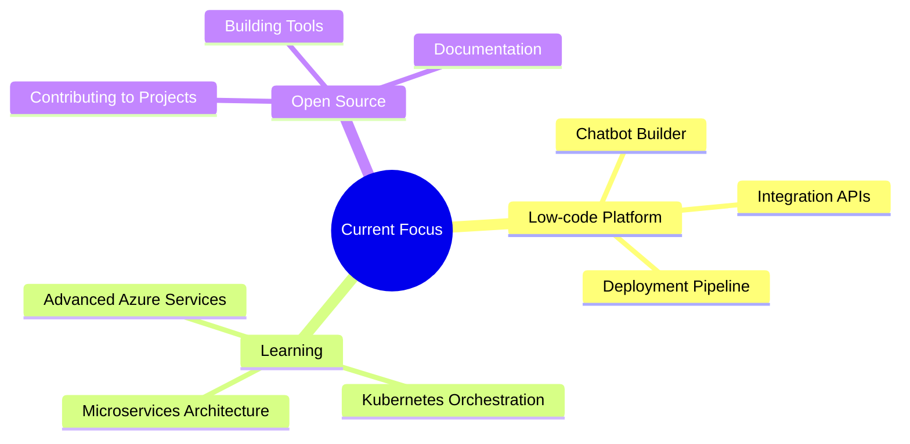

<div align="center">

<!-- Hero Section with Gradient Banner -->


<!-- Animated Typing Effect -->
<div align="center">
  
</div>

<!-- Professional Badges -->
<div align="center">
  <a href="mailto:kassimi.docs@gmail.com">
    
  </a>
  <a href="https://www.linkedin.com/in/abderrahmane-kassimi/" target="_blank">
    
  </a>
  <a href="https://github.com/tnt-747">
    
  </a>
</div>

<br/>

<!-- Profile Views Counter with Modern Style -->
<div align="center">
  
  
  
</div>

</div>

<br/>

<!-- About Me Section with Enhanced Design -->
<div align="center">
  
</div>

##  About Me

```typescript
const abderrahmane = {
    title: "Full Stack Engineer & Cloud Enthusiast",
    education: "Computer Science & Networks (MIAGE) @ EMSI Rabat",
    location: "Morocco 🇲🇦",
    currentFocus: "Low-code Chatbot Platform (Final Year Project)",
    
    coreStack: {
        backend: ["Spring Boot (Java)", "Django (Python)", ".NET (C#)", "PHP"],
        frontend: ["React.js", "JavaScript", "HTML5/CSS3", "Bootstrap"],
        databases: ["MySQL", "PostgreSQL", "SQL Server", "Oracle", "SQLite"],
        cloudDevOps: ["Microsoft Azure", "Docker", "Linux", "Git", "Bash"]
    },
    
    certifications: [
        "Microsoft Azure Fundamentals (AZ-900)",
        "Cisco CCNA",
        "Oracle Database Admin 2019",
        "ALX Software Engineering"
    ],
    
    principles: ["Clean Architecture", "DevOps Best Practices", "Scalable Solutions"],
    
    currentlyLearning: ["Microservices", "Kubernetes", "Advanced Cloud Architecture"],
    
    funFact: "I turn coffee ☕ into clean code 💻"
};
```

<br/>

---

<!-- Tech Stack Section with Modern Cards -->
##  Tech Stack & Tools

<div align="center">

### 🎨 Frontend Development
<p>
  
</p>

### ⚙️ Backend Development
<p>
  
</p>

### ☁️ Cloud & DevOps
<p>
  
</p>

### 🗄️ Databases
<p>
  
</p>

### 🛠️ Development Tools
<p>
  
</p>

</div>

<br/>

---

<!-- Certifications with Visual Cards -->
##  Professional Certifications

<div align="center">

| Certification | Provider | Badge |
|:-------------:|:--------:|:-----:|
| **Azure Fundamentals (AZ-900)** | Microsoft |  |
| **CCNA Certification** | Cisco |  |
| **Database Admin 2019** | Oracle |  |
| **Software Engineering** | ALX |  |

</div>

<br/>

---

<!-- GitHub Trophies -->
##  GitHub Achievements

<div align="center">
  
</div>

<br/>

---

<!-- GitHub Stats Dashboard -->
##  GitHub Statistics

<div align="center">
  
  <!-- Streak Stats -->
  
  
  <!-- Activity Graph -->
  
  
  <!-- Top Languages -->
  
  
  <!-- Contribution Graph -->
  

</div>

<br/>

---

<!-- Recent Activity -->
##  Recent GitHub Activity

<!--START_SECTION:activity-->
<!--END_SECTION:activity-->

<br/>

---

<!-- Projects Showcase -->
##  Featured Projects

<div align="center">

<table>
  <tr>
    <td width="50%">
      <h3 align="center">🤖 Low-code Chatbot Platform</h3>
      <div align="center">  
        <p>
          <strong>Final Year Project (PFA)</strong><br/>
          A comprehensive platform enabling users to create and deploy chatbots without extensive coding knowledge.
        </p>
        <p>
          
          
          
        </p>
      </div>
    </td>
    <td width="50%">
      <h3 align="center">☁️ Cloud Infrastructure Projects</h3>
      <div align="center">  
        <p>
          <strong>Azure-based Solutions</strong><br/>
          Implementing scalable cloud architectures using Microsoft Azure services and DevOps practices.
        </p>
        <p>
          
          
          
        </p>
      </div>
    </td>
  </tr>
</table>

</div>

<br/>

---

<!-- Current Focus -->
##  What I'm Currently Working On

<div align="center">



</div>

<br/>

---

<!-- Connect Section -->
##  Let's Connect!

<div align="center">

<p>
  <a href="mailto:kassimi.docs@gmail.com">
    
  </a>
  <a href="https://www.linkedin.com/in/abderrahmane-kassimi/">
    
  </a>
  <a href="https://github.com/tnt-747">
    
  </a>
</p>

<br/>

<!-- Quote -->


</div>

<br/>

---

<!-- Snake Animation -->
<div align="center">
  <picture>
    <source media="(prefers-color-scheme: dark)" srcset="https://raw.githubusercontent.com/tnt-747/tnt-747/output/github-contribution-grid-snake-dark.svg">
    <source media="(prefers-color-scheme: light)" srcset="https://raw.githubusercontent.com/tnt-747/tnt-747/output/github-contribution-grid-snake.svg">
    
  </picture>
</div>

<br/>

<!-- Footer Wave -->


---

<div align="center">
  
</div>
